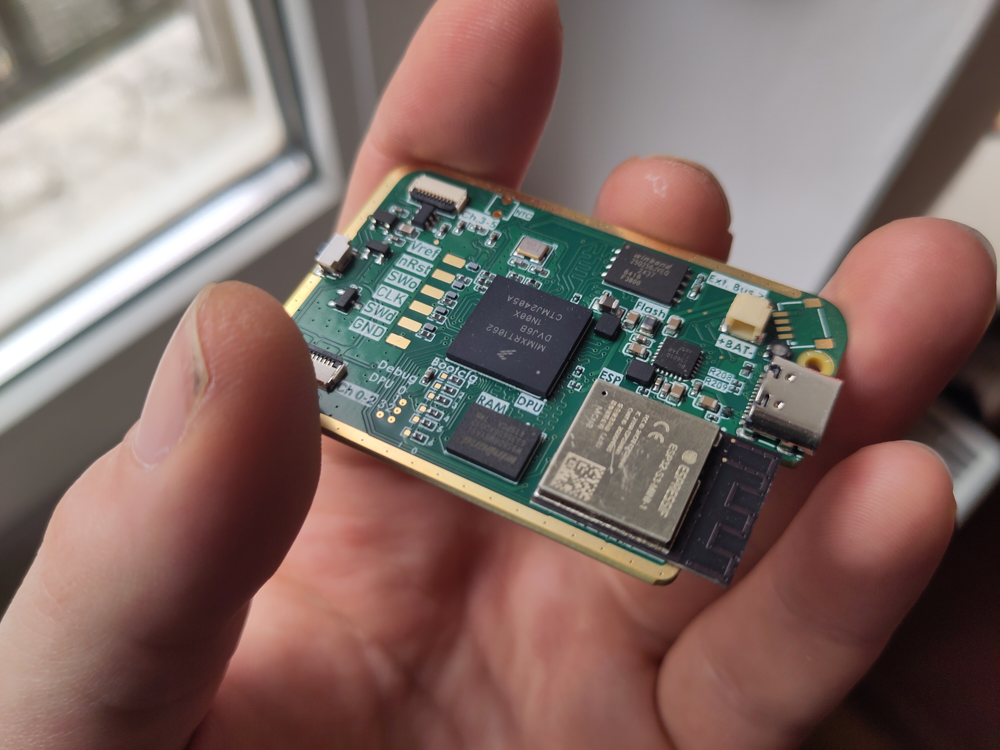
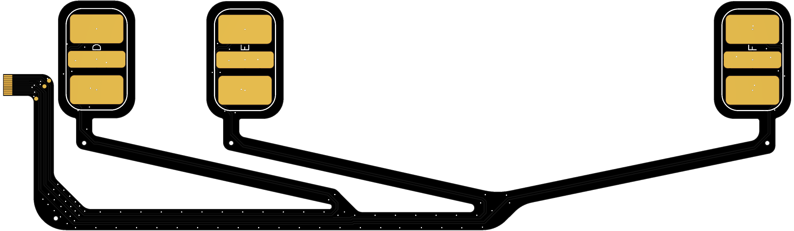
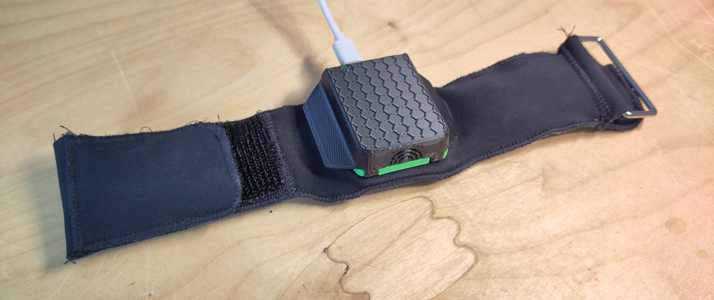
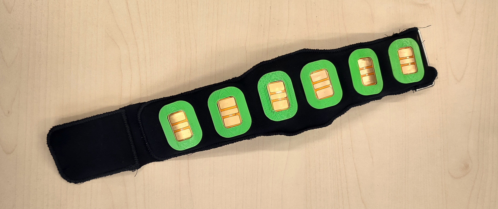

# MyoMod Armband – Open-Source 6-Channel EMG Interface

The **MyoMod Armband** is a modular, open-source **6-channel EMG (electromyography) armband** designed for real-time muscle signal acquisition of the forearm muscles near the elbow and transmission of the measured signals via Bluetooth Low Energy (BLE).


It's general purpose approach enables flexible use in human-machine interfaces, robotics, prosthetics, and research applications. It is part of the modular **MyoMod architecture,** and as such, the firmware of the armband is easily customizable. This also allows wired connections to external devices via MyoMod Link.

---

## 🧩 Architecture Overview

The Data Processing Unit (DPU) is the brain of the Armband and orchestrates all data transmission. It is based on the 600 MHz NXP i.MX RT 1062 microcontroller and, as such, can perform all the needed digital signal processing in real time and still has a lot of computational capacity left for other tasks.

Apart from the DPU the ESP32-S3 based BLE Bridge and the ADC are the most important components on the Armband. While the ADC captures the raw EMG signals that are to be filtered by the DPU, the BLE-Bridge implements a BLE Device and therefore is the interface to your web app, VR game, etc. The BLE-Bridge is connected to the DPU via MyoMod-Link (a modular, real-time protocol based on I²C) and an async UART-based protocol for configuration of the DPU (and for later firmware upgrades).

In its default configuration, the Armband transmits the filtered as well as the raw EMG data to the BLE host, so that you can either work directly with the EMG data or implement your own filter algorithm on the host device.


Next to these key devices, the Armband also includes

* a 6-DOF inertial measurement unit (IMU) that can further support the analysis of the measured EMG signals  
* a battery management system (BMS) for charging the Armband via USB-C  
* the user interface consisting of a button and an RGB LED  
* and finally, a socket for connecting an external MyoMod-Link device, thus allowing an easy extension of the capabilities of the armband or usage in an entirely new area.

---

## ⚙️ Hardware Overview

The MyoMod Armband consists of several components. The most important component, of course, is the **main board** that houses all the electronic components like the DPU, its external flash and RAM, but also the ADC. To meet all the requirements of these different areas (like **high-speed interconnection** between DPU and RAM but also dealing with **fragile EMG signals with only a few µV),** a lot of effort went into designing it with **mixed-signal design** approaches in mind while also keeping the costs low by using only a 4-layer PCB.



The actual **electrodes** are made with **flex PCBs** that are directly connected to the main board. This reduces the bill of materials, eases the assembly, and is easier to scale than using cables, etc., for interconnection. This advantage is leveraged by using **shielded** flex PCBs, as shielded cables increase the costs significantly.



But of course the MyoMod Armband wouldn't be an actual armband without the **textiles** and the several **housings**. The primary challenge for this lies in the **stretchability** of the armband, as it must fit for a range of different forearm circumferences. To allow this, we use a stretchable soft shell fabric and wind up the flex PCBs.




---

## 🧩 Integration into MyoMod ecosystem

The MyoMod Armband is part of the broader **MyoMod ecosystem**, which enables modular and open development of prosthetic and bio-signal systems. The ecosystem is built around the **Data Processing Unit (DPU)** that orchestrates communication between various input and output devices through the standardized **MyoMod-Link protocol**.

### Modular Architecture

The MyoMod ecosystem follows a **node-based abstraction model** where each sensor or actuator is represented as individual nodes that have ports for data interconnection and can be parameterized. This allows algorithms to be developed independently of the specific hardware configuration:

There are different types of **nodes**, separated by their function.

- **Devices**: Devices connected to the DPU via MyoMod-Link, they can be inputs, outputs, or both. Examples are EMG sensors, IMUs, force sensors, prosthetic hands, robotic actuators, feedback systems, or the BLE Bridge. Also bridges to other interfaces like SPI or UART could be devices.  
- **Embedded Devices**: The same as normal devices, but integrated into the DPU, e.g. the DPU of the Armband is directly connected to the ADC, but the ADC is still handled as a virtual or embedded device for the configuration.  
- **Algorithms**: Algorithms are nodes without connection to the external world. This could, for example, be algorithms for real-time signal processing, machine learning inference, or simple linear functions.


Devices can be connected to each other by connecting their **ports**. Ports have a defined data type, and only input and output ports of the same type can be connected. This allows powerful individualization of the system in the MyoMod ecosystem by non-programmers, as they only need to parameterize and connect different nodes in a visual configuration environment.


### Configuration Management

A configuration describes all used nodes, their parameters, and their interconnection. The system supports **multiple configurations** that can be switched at runtime, enabling, for example, task-specific optimization with different algorithms for precise vs. power-focused use cases with the same hardware.

MyoMod Link allows automatic detection of all connected devices; this in turn allows an automatic selection of configurations based on these connected devices. For prosthetics use cases this allows swapping the actual prosthetic hand and directly adapting the control algorithm to it. For the Armband this allows different behavior depending on the connected device at the expansion port, e.g. a connected display can show the muscle contraction in real-time, or a connected audio device produces sounds depending on the contracted muscles.

### MyoMod-Link Protocol

MyoMod-Link is a **modular, real-time protocol based on I²C** that provides:

- **100 Hz cyclic communication** for real-time EMG and control data  
- **Asynchronous register-based communication** for device configuration and status  
- **Plug-and-play device discovery** with automatic device identification  
- **Pipeline architecture** enabling parallel data processing and transmission  
- **Multi-port support** for bandwidth scaling across multiple I²C buses on DPU side

### Ecosystem Benefits

- **Modularity**: Easy integration of new sensors and actuators  
- **Scalability**: From simple 2-channel systems to complex multi-device setups  
- **Flexibility**: Runtime configuration switching for different use cases  
- **Development**: Simplified algorithm development independent of hardware  
- **Accessibility**: Cost-effective scaling based on user requirements

---

## 🧩 Digital processing of the EMG signals

The MyoMod Armband employs **digital** signal processing to overcome the limitations and costs of traditional analog EMG filtering systems. It does so by using a high resolution, low-noise Sigma-Delta ADC (MAX11254). The usage of a sigma delta ADC greatly reduces the requirements of the input antialiasing filters, as the digitizing frequency is several magnitudes higher than the actual sampling rate of the 24 Bit signal. This allows us to move the actual filtering to the digital domain and thus remove the high costs of precision analog filters otherwise needed for these weak EMG signals.


**Adaptive Processing:** The adaptive EMG filter can automatically adapt to interference by analyzing the signal in the frequency domain. For this, a 512-point FFT with an update rate of 100 Hz is used. This approach also allows for a consistent 0-1 output scaling across environments, is robust against many electronic device emissions (like monitors or microwaves), and also automatically handles 50/60 Hz power line interference. Last but not least, focusing on digital filtering allows for an easy replacement or refinement of this filter.

---

## 🧠 (Web)BLE API

The MyoMod Armband communicates with host devices via **Bluetooth Low Energy (BLE)** using a custom GATT service. The API provides real-time access to EMG data and device configuration.

### BLE Service & Characteristics

**Primary Service UUID:** `f1f1d764-f9dc-4274-9f59-325fea6d631b`

| Characteristic | UUID | Type | Description |
|---------------|------|------|-------------|
| **Raw EMG** | `9c54ed76-847e-4d51-84be-7cf02794de53` | Notify | Raw 6-channel EMG signals (15 samples/channel) |
| **Filtered EMG** | `36845417-f01b-4167-afa1-81b322238fe1` | Notify | Processed EMG data (6 channels + state) |
| **Combined EMG** | `ab92c948-16ed-4ed2-b18e-d4c0a27808fc` | Notify | Raw + filtered EMG in single packet |
| **DPU Control** | `5f2d5b5b-2166-4d71-9b4a-ea719ce9777e` | Write/Notify | Device configuration and control protocol |

### Data Structures


**EMG Data** (15 samples per channel):
```typescript
type MyoModEmgData = {
  chnA: Float32Array;  // Channel A samples
  chnB: Float32Array;  // Channel B samples  
  chnC: Float32Array;  // Channel C samples
  chnD: Float32Array;  // Channel D samples
  chnE: Float32Array;  // Channel E samples
  chnF: Float32Array;  // Channel F samples
};
```

**Filtered EMG Data**:
```typescript
type MyoModFilteredEmgData = {
  data: Float32Array;  // 6 processed channel values
  state: number;       // Processing state indicator
};
```

**Combined EMG Data**:
```typescript
type MyoModCombinedEmgData = {
  raw: MyoModEmgData;           // Raw EMG data (6 channels × 15 samples)
  filtered: MyoModFilteredEmgData;  // Filtered EMG data (6 channels + state)
};
```

**DPU Control Protocol**:

The async DPU control protocol is text based and is documented here: [MyoMod WebApp repository](#).

### WebBLE Implementation

A comprehensive React SDK is available with full API documentation, including connection management, data subscription, device configuration, and error handling. See the [MyoMod WebApp repository](#) for complete implementation details and examples.

**Browser Support**: Chrome/Edge 56+, Safari 16.4+. Requires HTTPS for WebBLE access.

### Unreal Engine Implementation

There is an existing implementation for real time transmission of the EMG data via BLE for the android platform in Unreal Engine. ATM we are discussing if it can be open-sourced due to the usage of a plugin used for BLE interaction.

---


## 🔗 Related Repositories

| Component | Description | Repository |
|------------|--------------|-------------|
| **MyoMod-Armband-Hardware** | CAD, PCB, and design files for the EMG armband | [Repository link placeholder](#) |
| **MyoMod-Armband-DPU** | Firmware for DPU, including EMG acquisition, modular RT scheduler, and preprocessing | [Repository link](https://github.com/MyoMod/MyoMod-Armband-DPU) |
| **MyoMod-Armband-BLE-Bridge** | Firmware for BLE-Bridge (ESP32-S3 based) | [Repository link](https://github.com/MyoMod/MyoMod-BleBridge) |
| **MyoMod-Protocol** | Definition of BLE services and data packet formats | [Repository link](https://github.com/MyoMod/DPU-Control-Protocol) |
| **MyoMod-WebApp** | Web interface for real-time EMG visualization and calibration | [Repository link](https://github.com/MyoMod/js-sdk/) |
| **MyoMod-BaseDevice** | Sample MyoMod Device (RP2030 based) | [Repository link](https://github.com/MyoMod/BaseDevice) |